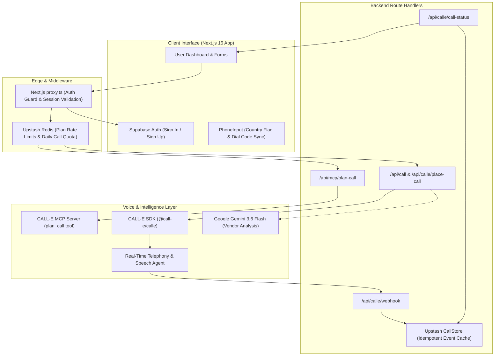

# CALL-E: Accessibility Voice Proxy
> **Empowering Deaf and speech-impaired individuals to make real-world phone calls with autonomy, dignity, and complete transparency.**

[](https://nextjs.org/)
[](https://react.dev/)
[](https://tailwindcss.com/)
[](https://supabase.com/)
[](https://upstash.com/)
[](https://call-e.app)

---

## 📌 The Problem

Despite the digital era, the physical world still runs on voice phone calls. Critical day-to-day tasks like:
- Rescheduling a dentist or doctor appointment,
- Checking in on delayed prescription deliveries or packages,
- Canceling subscriptions or memberships that require speaking to a retention rep,
- Checking in on elderly family members living alone,
- Relaying urgent messages with location details during emergencies,

...often have **no online chat alternative** or require navigating complex, auditory-only Interactive Voice Response (IVR) phone menus.

For **Deaf, hard-of-hearing, and speech-impaired individuals**, this creates an insurmountable everyday friction. Traditional relay services can feel cumbersome, slow, and invasive to personal privacy, leaving users feeling stripped of agency in their own daily lives.

---

## 💡 The Solution

**CALL-E** is an intelligent, human-in-the-loop voice proxy designed from the ground up for accessibility. Users type their requirements in plain language, and CALL-E places real telephone calls on their behalf—speaking clearly and naturally, navigating real-time conversations, and reporting back with factual transcripts, evidence, and structured outcomes.

### Core Principles & Key Features

1. **Human-in-the-Loop Transparency**:
   - The AI is **never a black box**. The interface explicitly answers: *What is CALL-E doing? Who is CALL-E contacting? What was spoken? What does the user need to do next?*
   - Users review and approve the exact prompt and plan before any telephone number is dialed.
2. **Purpose-Built Accessible Templates**:
   - **Appointment Booking**: Handles date ranges, service types, and schedules confirmation calls.
   - **Service Cancellation**: Firm, polite cancellation requests with optional account references.
   - **Order & Delivery Status**: Inquires about parcel locations, tracking, and delivery timelines.
   - **Elder Check-in**: Friendly, compassionate check-in covering personalized wellness topics.
   - **Relay / Emergency Message**: One-click message relay with optional browser-verified GPS location sharing and explicit user consent.
3. **Two-Phase Custom Call Flow (MCP-Powered)**:
   - For open-ended needs, an interactive planning assistant asks clarifying questions one by one. Once ready, it synthesizes an editable script for human review before execution.
4. **Multi-Region & Native Language Support**:
   - Full international phone handling across Pakistan (`PK`), United States (`US`), United Kingdom (`GB`), India (`IN`), and UAE (`AE`) with multi-lingual voice delivery in English and Urdu (`ur`).
5. **Calm, High-Polish Design**:
   - Styled with intentionality inspired by Linear and Stripe. Avoids gimmicky AI tropes (no sci-fi neon orbs, space backgrounds, or purple glows) in favor of clear typography (Geist), accessible color contrast, and intuitive feedback.

---

## 🏗️ Architecture / How It Works



### Step-by-Step Data Flow

1. **User Authentication & Session Guard**: The user logs in via Supabase Auth. The Next.js 16 `proxy.ts` layer validates session cookies and routes traffic securely.
2. **Quota & Rate Limiting Check**: Requests pass through Upstash Redis to ensure users stay within planning thresholds (10 req/min) and daily call limits (5 calls/day) to prevent accidental bill shock or abuse.
3. **Interactive Call Formulation**:
   - *Via Guided Template*: Strict Zod schemas format the objective deterministically into natural speech tasks.
   - *Via Two-Phase MCP*: The Model Context Protocol broker connects with CALL-E's `plan_call` tool, clarifying ambiguous user requests until `ready_to_run: true`.
4. **Human Review & Dispatch**: The user inspects the final task prompt and approves the call. The backend calls `client.calls.create(...)` via the `@call-e/calle` SDK.
5. **Real-World Telephony Execution**: The CALL-E telephony agent dials the recipient phone, conducts the conversation with low-latency speech-to-speech AI, and records structured evidence.
6. **Idempotent Webhook Processing**: CALL-E posts the completion payload to `/api/calle/webhook`. Upstash Redis deduplicates delivery via `SET NX` locks and caches the outcome.
7. **Evidence Presentation**: The frontend polls `/api/calle/call-status` and renders a clean, human-readable summary with extracted evidence and quota status.

---

## 💻 Tech Stack

| Layer | Technology | Purpose |
|---|---|---|
| **Frontend** | [Next.js 16.3.2](https://nextjs.org/) (App Router, Turbopack) | Server & Client components, modern routing architecture |
| **UI & Styling** | [Tailwind CSS v4](https://tailwindcss.com/) & [Geist Font](https://vercel.com/font) | Accessible design system, clean contrast, responsive layout |
| **Language** | [TypeScript](https://www.typescriptlang.org/) & [React 19](https://react.dev/) | End-to-end type safety, modern concurrent UI |
| **Validation** | [Zod v4](https://zod.dev/) | Strict input sanitization and schema contracts for all call targets |
| **Authentication** | [Supabase Auth](https://supabase.com/docs/guides/auth) (`@supabase/ssr`) | SSR cookie-based authentication, user identity management |
| **Database & Cache** | [Upstash Redis](https://upstash.com/) (`@upstash/redis`, `@upstash/ratelimit`) | Sliding-window rate limiters, daily quotas, idempotent call store |
| **Voice Telephony** | [CALL-E SDK](https://call-e.app) (`@call-e/calle`) | Outbound AI telephone calling, speech recognition, speech synthesis |
| **Agent Protocol** | [Model Context Protocol (MCP)](https://modelcontextprotocol.io/) | Multi-turn planning, question clarification, agent tool orchestration |
| **LLM Reasoning** | [Google Gemini 3.6 Flash](https://ai.google.dev/) | Comparative vendor response analysis and intelligent decision-making |

---

## 🏆 Sponsor Integrations

This project integrates tools and APIs from hackathon sponsors:

### 1. CALL-E Voice AI SDK (`@call-e/calle`)
* **How it's used**: Serves as the voice engine of the platform. Dispatches asynchronous outbound voice calls to global carriers with customized locale, voice tasks, metadata, and structured result schemas.
* **Key Implementation**: [`app/api/call/route.ts`](file:///home/rabia/calle-callproxy/app/api/call/route.ts), [`app/api/calle/place-call/route.ts`](file:///home/rabia/calle-callproxy/app/api/calle/place-call/route.ts), [`app/api/calle/webhook/route.ts`](file:///home/rabia/calle-callproxy/app/api/calle/webhook/route.ts).

### 2. Model Context Protocol (MCP)
* **How it's used**: Integrates with CALL-E's MCP server over HTTP/OAuth using a brokered session manager. Powers the dynamic two-phase conversation planner (`plan_call` tool) that interrogates edge cases before a call is dialed.
* **Key Implementation**: [`lib/mcp/brokerclient.ts`](file:///home/rabia/calle-callproxy/lib/mcp/brokerclient.ts), [`app/api/mcp/plan-call/route.ts`](file:///home/rabia/calle-callproxy/app/api/mcp/plan-call/route.ts).

### 3. Upstash Redis
* **How it's used**:
  1. High-throughput rate limiting (`@upstash/ratelimit`) for AI planning routes (10 req/min sliding window).
  2. Fixed 24-hour window quotas (5 outbound phone calls per user per day).
  3. Idempotent webhook event store (`SET NX`) to prevent double-processing of carrier callbacks.
* **Key Implementation**: [`lib/ratelimit.ts`](file:///home/rabia/calle-callproxy/lib/ratelimit.ts), [`lib/calle/callStore.ts`](file:///home/rabia/calle-callproxy/lib/calle/callStore.ts).

### 4. Supabase
* **How it's used**: Manages user authentication and secure SSR sessions via `@supabase/ssr` cookies, enforced via Next.js 16's `proxy.ts` middleware. Also securely holds persistent MCP broker tokens with RLS.
* **Key Implementation**: [`proxy.ts`](file:///home/rabia/calle-callproxy/proxy.ts), [`lib/supabase/client.ts`](file:///home/rabia/calle-callproxy/lib/supabase/client.ts), [`lib/supabase/server.ts`](file:///home/rabia/calle-callproxy/lib/supabase/server.ts).

### 5. Google Gemini (Google AI Studio)
* **How it's used**: Powers multi-vendor parallel call synthesis. When comparing 2–5 service vendors, Gemini reviews extracted quotes, timings, and notes to select the best option with explainable reasoning.
* **Key Implementation**: [`lib/templates/vendorComparison.ts`](file:///home/rabia/calle-callproxy/lib/templates/vendorComparison.ts).

---

## 🚀 Setup & Installation

### Prerequisites
- **Node.js**: v20.x or higher
- **npm** (or `pnpm`)
- Free accounts for:
  - [CALL-E](https://call-e.app) (API Key)
  - [Supabase](https://supabase.com) (Project URL, Anon Key, Service Role Key)
  - [Upstash](https://upstash.com) (Serverless Redis REST URL & Token)
  - [Google AI Studio](https://aistudio.google.com/) (Optional: Gemini API Key for vendor comparisons)

---

### 1. Clone the Repository
```bash
git clone https://github.com/your-username/calle-callproxy.git
cd calle-callproxy
```

### 2. Install Dependencies
```bash
npm install
```

### 3. Configure Environment Variables
Copy the template configuration file:
```bash
cp .env.example .env.local
```

Fill in your API credentials in `.env.local`:
```env
# CALL-E Voice SDK
CALLE_API_KEY="your-calle-api-key"

# Public App URL (No trailing slash; use your ngrok or deployed domain for webhooks)
APP_BASE_URL="http://localhost:3000"

# Supabase Auth & DB
NEXT_PUBLIC_SUPABASE_URL="https://your-project.supabase.co"
NEXT_PUBLIC_SUPABASE_ANON_KEY="your-supabase-anon-key"
SUPABASE_SERVICE_ROLE_KEY="your-supabase-service-role-key"

# Upstash Redis (Rate limiting & Call cache)
UPSTASH_REDIS_REST_URL="https://your-redis.upstash.io"
UPSTASH_REDIS_REST_TOKEN="your-upstash-token"

# Optional: Google Gemini API (for vendor comparison synthesis)
GEMINI_API_KEY="your-gemini-api-key"
```

> **Note on Webhooks locally**: If testing outbound telephone call status updates on `localhost`, use [ngrok](https://ngrok.com/) (`ngrok http 3000`) and set `APP_BASE_URL` to your ngrok URL so CALL-E can reach `/api/calle/webhook`.

### 4. Build and Run the App
```bash
# Run local development server
npm run dev
```

Open [http://localhost:3000](http://localhost:3000) in your browser.

To verify a production build:
```bash
npm run build
npm start
```

---

## 📸 Demo & Screenshots

| Feature | Description |
|---|---|
| 🔗 **Live Demo** | *[Insert Live App Deployment Link Here]* |
| 📹 **Video Walkthrough** | *[Insert Loom / YouTube Hackathon Demo Link Here]* |

### Key User Experiences

#### 1. Home Dashboard & Quick Quota
*Clean overview showing user greeting, daily remaining call limits, and 1-click access to all calling actions.*

```
+-------------------------------------------------------------------------+
| CALL-E       Home   Templates   Custom Call   Relay Message    Sign out |
+-------------------------------------------------------------------------+
| Good afternoon, Sarah.                                                  |
| What would you like CALL-E to do for you?                               |
|                                                                         |
| [ Book an Appointment ]    [ Custom Call ]     [ Check Order Status ]   |
| [ Relay a Message ]        [ Cancel Service ]  [ Elder Check-in ]       |
|                                                                         |
| [i] How CALL-E works: You instruct in writing. CALL-E speaks on phone.  |
+-------------------------------------------------------------------------+
```

#### 2. Accessible Phone Input with Country Code & Region Sync
*Restricted digit input paired with accessible native selector that synchronizes flags, international dial codes, and backend carrier regions.*

#### 3. Two-Phase Planning with Clarifying Questions
*Multi-turn MCP agent loop asks needed questions before drafting the final task script.*

#### 4. Post-Call Evidence & Structured Extraction
*Comprehensive breakdown of what was confirmed, timestamps, and factual evidence without raw JSON clutter.*

---

## ♿ Accessibility & Intentionality

CALL-E was built with the belief that AI should be accessible, empowering, and respectful. Every design choice reflects that:
- **No sensory overload**: High contrast, neutral palette, and absence of distracting animations.
- **Auditory independence**: Speech-to-speech interactions are completely translated into actionable, written evidence for the user.
- **Safety & Control**: Confirmation gates ensure no call is placed accidentally.

---

## 📄 License

This project is licensed under the **MIT License**.
